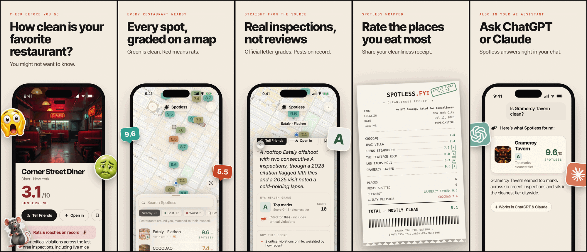
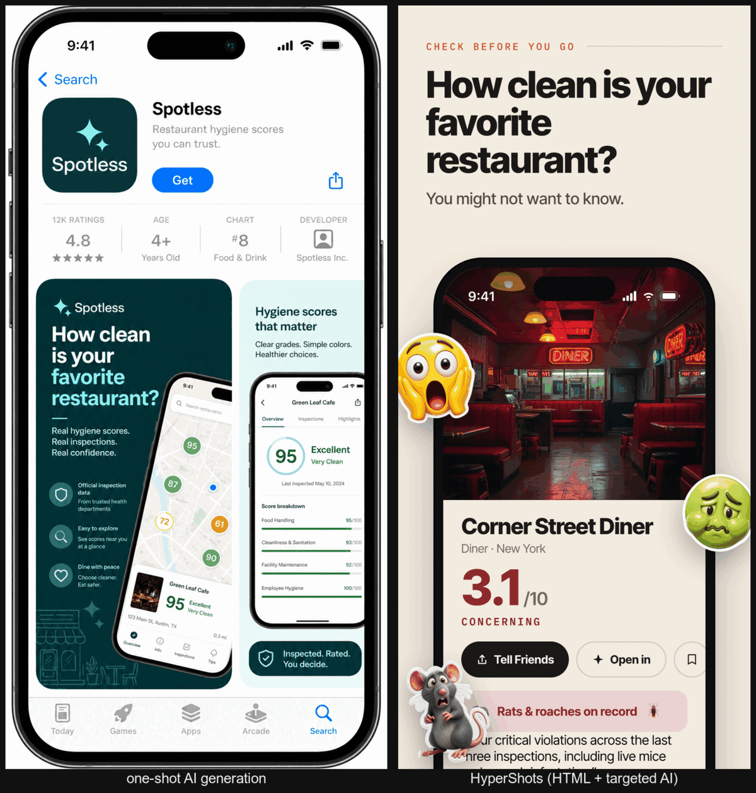
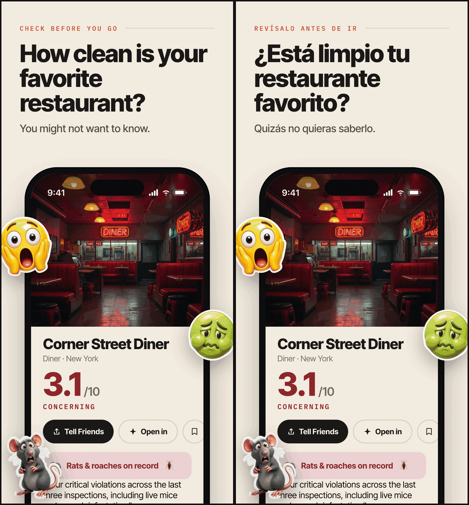

# HyperShots

**App Store screenshots that pass validation the first time, in every language — deterministic HTML where Apple has rules, generative AI where it sells.**



*This set was submitted to the App Store with Spotless v1.0 (July 2026).*

## Install

```bash
npx skills add hypersocialinc/hypershots --skill hypershots --agent claude-code
```

For Codex, use `--agent codex` (the skill ships `agents/openai.yaml`).

## Why not just generate the whole image?



Device frames and store canvases are pure geometry — an agent expresses them perfectly in CSS arithmetic, while an image model only approximates them: asked for a marketing panel, one-shot generation drew a picture *of* the App Store, with warped nested frames, melted small text, and a 1024×2048 canvas Apple doesn't accept. HyperShots is deterministic everywhere Apple has rules — frame, fonts, copy, exact pixels, locales — and generative only where it helps: cutout sticker assets and an optional style grade. The half you must get right is arithmetic; the half that sells is the only part left to the model.

## Every language, one command



One command per locale: string extraction via `data-i18n` markers, atomic injection (missing or unused keys are fatal), auto-fit headlines that shrink until they clear the device — same layout, translated copy, re-validated output.

## 60-second quickstart

```text
$ npx skills add hypersocialinc/hypershots --skill hypershots --agent claude-code

you>  Make App Store screenshots for my app. Captures are in ./captures.

agent> bash <skill>/scripts/scaffold.sh .shots
       # asks the brief questionnaire: positioning, panel count,
       # headlines, stickers, device profile, locales — then authors
       # bespoke panel HTML and a theme layer from your brand

agent> bash <skill>/scripts/render.sh .shots iphone-6.9 en
       rendered panel-1 -> .shots/out/iphone-6.9/en/panel-1.png (target 1290x2796)
       ...
       OK: 5 panels rendered for iphone-6.9/en

agent> bash <skill>/scripts/validate.sh .shots iphone-6.9 en
       PASS panel-1.png 1290x2796 alpha:no profile:ok
       PASS panel-2.png 1290x2796 alpha:no profile:ok
       PASS panel-3.png 1290x2796 alpha:no profile:ok
       PASS panel-4.png 1290x2796 alpha:no profile:ok
       PASS panel-5.png 1290x2796 alpha:no profile:ok
       VALIDATED: 5 panels, 1290x2796, store-compliant

agent> node <skill>/scripts/make-review.mjs .shots
       # opens an App Store-style review page — give feedback by panel number
```

The rendered PNGs in `out/` upload to App Store Connect as-is.

## How it works

| Deterministic (HTML/CSS + headless Chrome) | Generative (opt-in, via genmedia/fal.ai) |
|---|---|
| Device frame geometry (Dynamic Island, bezels, screen aspect) | Cutout sticker assets: GPT Image 2 → BiRefNet v2 background removal → transparent PNG |
| Vendored fonts (`@font-face`, no network race) | Photographic backgrounds |
| Exact store canvas from per-profile CSS variables | Optional whole-panel style grade (GPT Image 2 edit, set-consistent via a style anchor) |
| Per-locale copy with `data-i18n` markers + auto-fit | Protected mode: frame and text regions are masked, then **re-composited from the clean render** — AI never ships your typography |
| `validate.sh`: dimensions, alpha, ICC profile, panel count | |

## Store specs (what the validator enforces)

| Device class | Exact px (portrait) | Notes |
|---|---|---|
| iPhone 6.9″ | 1290×2796 or 1320×2868 | The only *required* iPhone size; Apple auto-scales it down. Default profile. |
| iPhone 6.5″ | 1284×2778 or 1242×2688 | Legacy slot, still accepted (the Spotless set shipped it). |
| iPad 13″ | 2064×2752 or 2048×2732 | Required only if the app ships an iPad build. |

Plus the asset rules: PNG, flattened (no alpha), untagged or sRGB ICC, max 10 per device size per localization — `validate.sh` checks all of it after every render, so a set that renders green cannot be rejected for asset specs.

## How this differs

- **fastlane frameit** — device frames around captures with basic bezel-text titles (localizable via `.strings`); no bespoke panel layout, generated assets, or spec validation.
- **ParthJadhav/app-store-screenshots** — a template editor webapp; HyperShots is agent-authored bespoke HTML per app, no template library.
- **adamlyttleapps' ASO screenshots skill** — Pillow scaffold + AI polish; similar thesis, different guarantees.
- **SaaS editors** (AppScreens, AppLaunchpad, Screenshots.pro) — template picking in a browser, per-seat pricing, no agent workflow.

What no surveyed tool combines: a **hard validator** (dimensions, alpha, ICC, count — enforced, not documented), **translate mode with auto-fit** as a first-class gear, the **cutout-sticker pipeline** (generate → background-removal → transparent PNG), and the **protected style grade** (mask + re-composite, so graded panels keep pixel-exact frames and text).

## Requirements

- **Chrome or Chromium** and **Node** — required. That's the whole deterministic pipeline.
- **ImageMagick** — optional: validator fix-ups (alpha flatten) and style-grade compositing.
- **genmedia + `FAL_KEY`** — optional and consent-gated: only generated assets and the style grade need it. Everything else works without any AI at all.

## Roadmap

- **Google Play** — phone screenshots 1080×1920 + the 1024×500 feature graphic. Specs are already documented in `references/store-specs.md`; **good first PR**.
- iPad authoring pass (required when the app ships an iPad build — 0.75 aspect, a fresh pass from the same brief, not a re-render).
- Landscape sets.
- Dark-mode sets (cheap via theme tokens).
- RTL + CJK locales (needs a Noto fallback stack; today's vendored fonts cover Latin incl. Central/Eastern European).
- Provider choice beyond fal/genmedia.
- App-preview video — out of scope; see [hypersocialinc/agent-skills](https://github.com/hypersocialinc/agent-skills) `transparent-video` for the alpha-video bridge.

## FAQ

**How do I capture the app screenshots that go inside the frame?**
That's upstream of HyperShots — use `fastlane snapshot` or your simulator tooling, then point the brief at the captures.

**How do I upload the finished set?**
`fastlane deliver`. HyperShots produces exactly the assets a deliver lane consumes (`out/<profile>/<locale>/panel-*.png`).

**Can I use it without any AI?**
Yes. The deterministic half is standalone: bring your own PNGs or plain emoji instead of generated stickers, skip the style grade, and nothing ever needs a fal key.

**License?**
MIT. Vendored fonts (Inter Tight, IBM Plex Mono) are SIL OFL 1.1.

---

MIT © 2026 HyperSocial Incorporated · fonts under the SIL Open Font License 1.1
